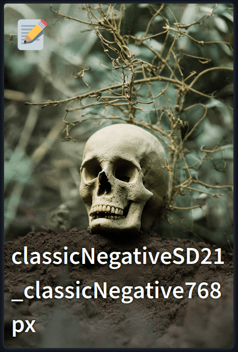

# Extra Models

Model notes are integrated directly into the extra model cards with a preview (which can be disabled in the [settings](settings.md)) and a `📝` Button which opens a popup with the note editor.

The note editor supports the same features as the [model notes tab](model_notes_tab.md) with support for markdown and autosaving. Clicking outside the popup or the closing x will close the popup but **not** save the note if autosaving is disabled.
