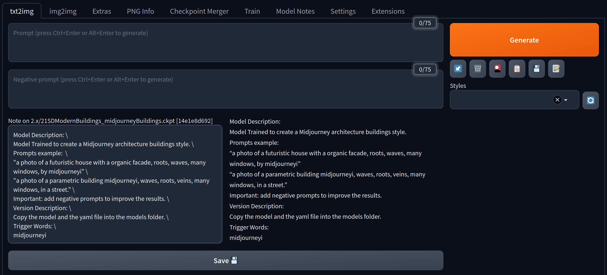

# Generation Interface

Notes for stable diffusion models are directly integrated in the main generation interface. It can be opened and closed by clicking on the `📝` tool button under the `Generate` button. All edit features from the [Model Notes Tab](model_notes_tab.md) are supported here as well.
