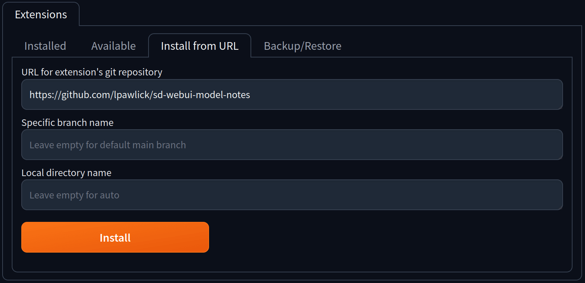

# Installation

Select the tab `Extensions`, select the subtab `Install from URL` and insert the following url:

```bash
https://github.com/lpawlick/sd-webui-model-notes
```

Press install, restart the webui and the Model Notes tab should appear.

