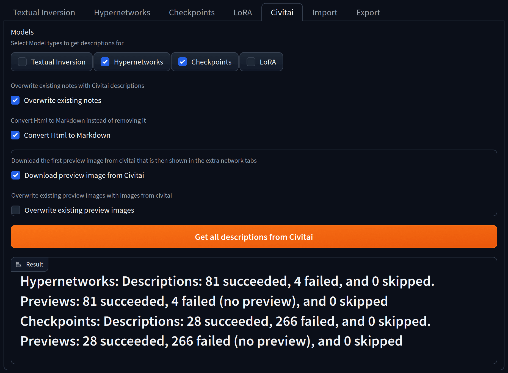
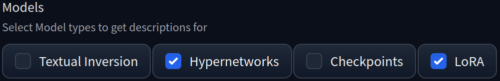
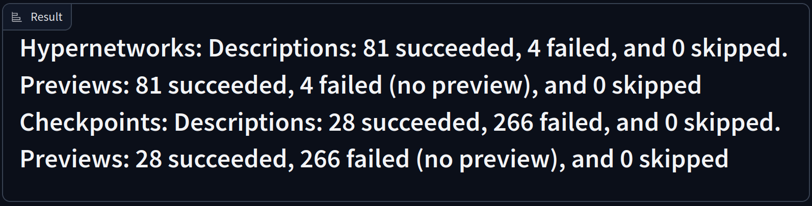

# Model Notes Tab

The tab that gets added when installing this extension.

## Model Tabs


Allows editing notes for the supported models.
Currently the following models are supported:

- Textual Inversion
- Hypernetworks
- Checkpoints
- LoRA

Select a Model tab of your choosing, select a model from the Dropdown and edit your note.

If Markdown is enabled then you need to press the `Edit Markdown ✏️` button to edit the note, you are then presented with a markdown editor and a preview of the written markdown.

Get the description from [Civitai](https://civitai.com) by pressing the `Get description from Civitai` which will replace the existing note if it exists.

```{note}
Model Notes are only saved if you press the `Save 💾` Button or automatically if autosaving is enabled in the Settings!
```

## Civitai



In this tab notes can be downloaded from [civitai](https://civitai.com) descriptions and preview images from [civitai](https://civitai.com) previews.

### Models



Select the Model Types you want to download notes for. It will iterate over all selected models that are one of the selected types and will ignore all models types that are not selected. This uses the built in logic of the webui to determine the model type.

### Download: Overwrite existing Notes


If checked then any existing notes will be overwritten with the descriptions from civitai, otherwise these notes will be skipped.

```{warning}
Any overwritten notes cannot be recovered, unless you have a backup!
```

### Convert Html to Markdown


If checked then it will try to convert the html tags to markdown. This will should preserve any formatting, like **bold** or *italic* text, [links](https://github.com/lpawlick/sd-webui-model-notes) or images. Otherwise any html tags will be stripped and only the raw text will be kept.

```{note}
This option is only available if markdown is supported enabled in the settings!
```

### Download preview image from Civitai


If checked then it will download the preview image, which is shown in the extra networks tab, from civitai. It will download the first image from the `images` field returned by [this](https://github.com/civitai/civitai/wiki/REST-API-Reference#get-apiv1models-versionsby-hashhash) Civitai endpoint.
If unchecked then no images will be downloaded

### Overwrite existing preview images


If checked then it will overwrite any existing preview images. Otherwise it will downloading any previews for models that already have one.

### Download Result



Shows a progressbar and the statistics of the download once finished.
First it lists the model type the statistics apply to, then how many descriptions were downloaded, how many were skipped and how many failed. If downloading previews was enabled then it will show the same information about the previews.
A successful download is a note or preview that was downloaded and saved without any exception. A download was skipped when the selected options prevented it from being downloaded, for example when a note already exists and the overwrite option was not selected. A downloaded failed if either the model was not found on civitai or if the model has no descriptions or preview image.
If an exception occurs then the download will be aborted and the exception will be shown in the console.

## Import


Import notes from other extensions or applications in a variety of formats.

### Import Formats


The file format of the notes that should be imported.
Html will be converted to markdown regardless if markdown support is enabled.

### Import from the models folder


If checked then it will search for model notes in the same folders as the models are. This uses the paths provided by the webui.

### Import Directory Path


The directory where notes should be imported from. Should be the full path to the directory, for example `C:\Users\%username%\stable-diffusion-webui\models\` or `/home/$USER/stable-diffusion-webui/models/`.
This option is only visible if `Import from the models folder` is unchecked.

### Import Filename


How the note file name should be mapped to the model file. It has the following options:

- Model Name: The note file has the same name as the model file but with the selected format extension, for example if the model file name is `v2-1_768-nonema-pruned.safetensors` then the note file should be in the same folder (or the selected folder) named `v2-1_768-nonema-pruned.txt`or `v2-1_768-nonema-pruned.md` based on the selected import format.
- Sha256: The note is named like the sha256 hash of the model file, for example the model name is the model file name is `v2-1_768-nonema-pruned.safetensors` and the sha256 of that file is `ad2a33c361c1f593c4a1fb32ea81afce2b5bb7d1983c6b94793a26a3b54b08a0` and the note file should be in the same folder (or the selected folder) and named `ad2a33c361c1f593c4a1fb32ea81afce2b5bb7d1983c6b94793a26a3b54b08a0.txt` or `ad2a33c361c1f593c4a1fb32ea81afce2b5bb7d1983c6b94793a26a3b54b08a0.md` based on the selected import format.

### Import: Overwrite existing notes


If checked then any existing notes will be overwritten by the imported notes. Otherwise models with existing notes will be skipped.

```{warning}
Any overwritten notes cannot be recovered, unless you have a backup!
```

### Import Result


It lists the amount of notes it successfully imported, how many notes could not be mapped to any models, how many notes were skipped and how many failed to import.
A successful import is a note that was imported without any exception. No Note means no model could be mapped to the note. An import was skipped when the selected options prevented it from being imported, for example when a note already exists and the overwrite option was not selected. Notes failed to import if the note file could not be read or an exception occurred while importing the note. Any exception will be shown in the console. Any exceptions will be shown in the console.

## Export


Exports notes to local files or a csv chart for external tools.

### Export Format


The file format of the notes that should be exported.
Text and Markdown will be converted to html if the html format is selected.

### Export into the models folder


If checked then it will export the model notes into the folders where the models are located. This uses the paths provided by the webui.

### Export Directory Path


The directory where notes should be exported to. Should be the full path to the directory or file in the case of the csv file. For example `C:\Users\%username%\stable-diffusion-webui\models\` or `/home/$USER/stable-diffusion-webui/models/`.
This option is only visible if `Export into the models folder` is unchecked.

### Export Filename


How the note file should be named. If csv was picked as an export option then this will define the first column. It has the following options:

- Model Name: The note file has the same name as the model file but with the selected format extension, for example if the model file name is `v2-1_768-nonema-pruned.safetensors` then the note file should be in the same folder (or the selected folder) named `v2-1_768-nonema-pruned.txt`or `v2-1_768-nonema-pruned.md` based on the selected export format.
- Sha256: The note is named like the sha256 hash of the model file, for example the model name is the model file name is `v2-1_768-nonema-pruned.safetensors` and the sha256 of that file is `ad2a33c361c1f593c4a1fb32ea81afce2b5bb7d1983c6b94793a26a3b54b08a0` and the note file should be in the same folder (or the selected folder) and named `ad2a33c361c1f593c4a1fb32ea81afce2b5bb7d1983c6b94793a26a3b54b08a0.txt` or `ad2a33c361c1f593c4a1fb32ea81afce2b5bb7d1983c6b94793a26a3b54b08a0.md` based on the selected export format.

### Export: Overwrite existing notes


If checked then any existing note files will be overwritten by the exported notes. Otherwise models existing notes will be skipped.

```{warning}
Any overwritten notes cannot be recovered, unless you have a backup!
```

### Export Result


It lists the path or file where the notes where exported to. It also lists how many notes were successfully exported, how many notes where empty or could not be found an how many notes failed to export. The reason for a failed export will be shown in the console.
