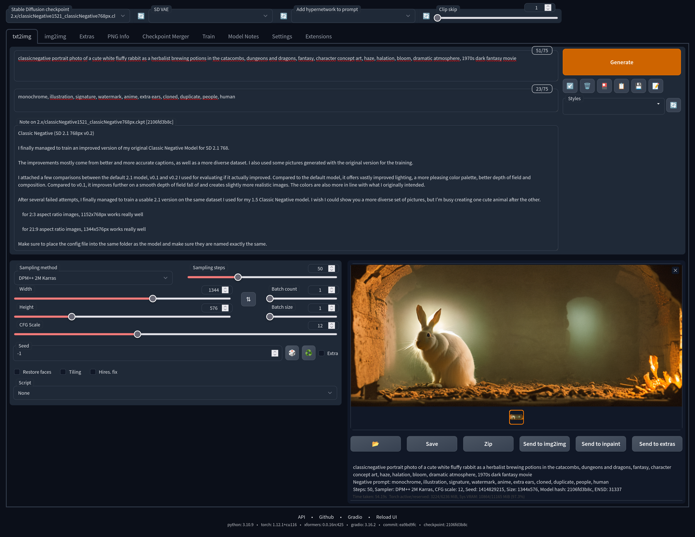
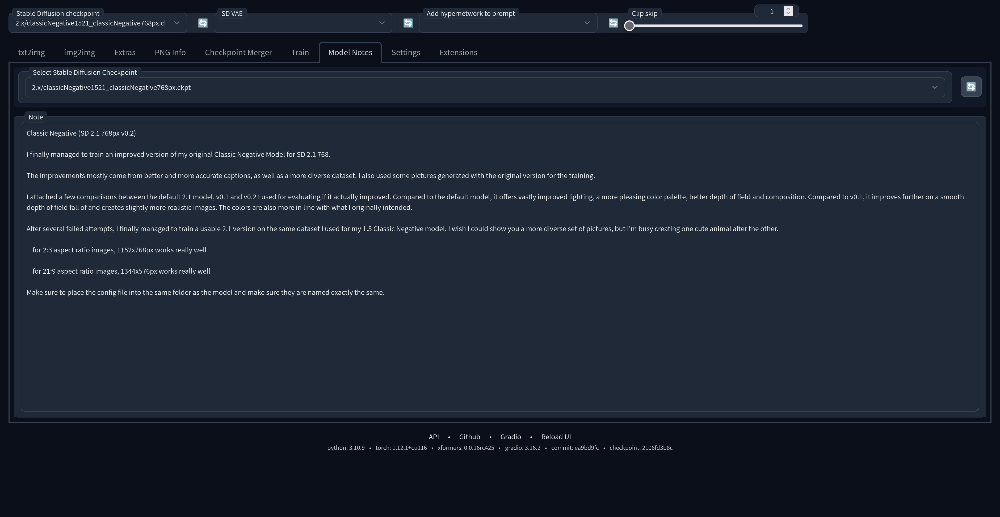

# stable-diffusion-webui model notes

This is an extension for the [AUTOMATIC1111 webui](https://github.com/AUTOMATIC1111/stable-diffusion-webui), which lets you save notes about models.

## Installation

Select the extensions, install from url and insert the url of this repository. Don't forget to reload the ui afterwards.

## Usage

Open the "Model Notes" tabs, select a model and add a note. The selection process might take a bit if the model was never selected in the interface before.
Any notes can also be accessed and edited in the generation interface itself by just pressing the 📝 tool button.

## Screenshots

